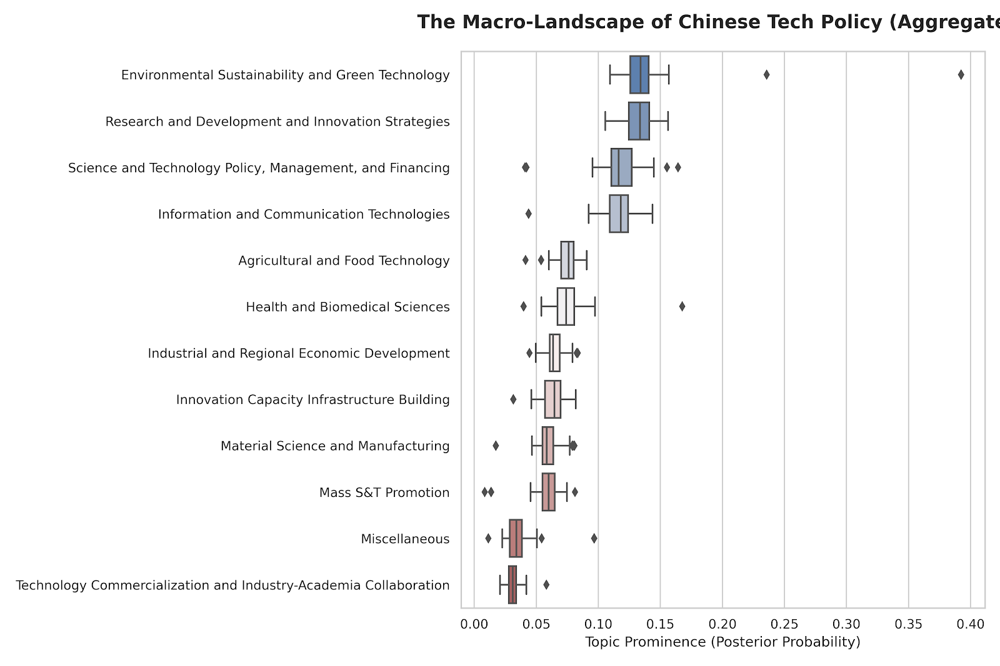
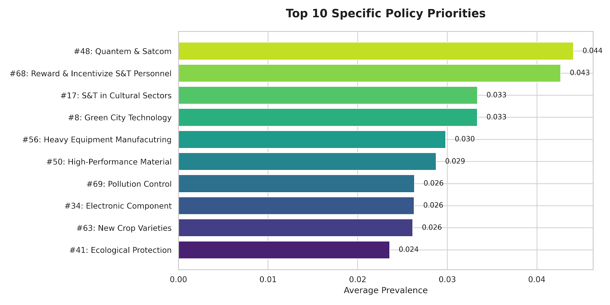

# 🇨🇳 China Tech Policy Monitor | Structural Topic Modeling (STM) Dashboard

An interactive NLP dashboard designed to quantify and visualize shifts in Chinese industrial policy. This tool leverages a pre-trained **Structural Topic Model (STM)** to map unseen government documents against 74 distinct policy topics (e.g., "Made in China 2025", "Green Energy", "R&D Financing").

Built with **R Shiny**, this project features an automated model provisioning architecture that decouples the heavy model weights from the codebase, ensuring a lightweight and reproducible repository.

## 🚀 Key Features

* **Automated Model Provisioning:** The application automatically detects if the pre-trained model weights (200MB+) are missing and securely downloads them from GitHub Releases upon the first launch.
* **Real-time NLP Scoring:** Upload any new policy document (Excel/CSV), and the system uses `fitNewDocuments` to project it onto the existing 74-dimensional topic space.
* **Advanced Chinese Pre-processing:** Integrated `jiebaR` segmentation pipeline with custom stop-word removal, regex cleaning for administrative terms (e.g., "省", "市"), and temporal filtering.
* **Thematic Aggregation:** Automatically aggregates micro-topics into 12 macro-strategic groups (e.g., "Research & Development", "Tech Commercialization").

## 🛠 Tech Stack

* **Core Logic:** R Language
* **Web Framework:** R Shiny
* **NLP & Modeling:** `stm` (Structural Topic Model), `jiebaR` (Chinese Segmentation), `quanteda`
* **Data Manipulation:** `tidyverse`, `stringi`

## 📂 Repository Structure

```text
china-policy-monitor/
│
├── app.R                  # Main application entry point (UI & Server)
├── data/                  # NLP Assets & Dictionaries
│   ├── add_word.txt       # Custom user dictionary for Jieba
│   ├── cn_stopwords.txt   # Stopwords list
│   └── Topic Labels.csv   # Mapping of Topic IDs to human-readable names
└── README.md              # Project documentation

(Note: The models/ folder is NOT in the repo. It will be automatically created on your local machine to store the .RData file when you first run the app.)
```

## 💻 Installation & Usage
**Prerequisites**
R (Version 4.0 or higher)
RStudio (Recommended)

### Quick Start
You **do not** need to manually download the large model file. The script handles it for you.

1.  **Clone the repository:**
    ```bash
    git clone [https://github.com/chrisxu220-code/china-policy-monitor.git](https://github.com/chrisxu220-code/china-policy-monitor.git)
    ```

2.  **Open the project in RStudio:**
    Open `app.R`. RStudio usually prompts to install missing packages (`shiny`, `stm`, `jiebaR`, etc.). If not, run this in the console:
    ```r
    install.packages(c("shiny", "tidyverse", "jiebaR", "stm", "readxl", "writexl", "quanteda", "stringi"))
    ```

3.  **Run the App:**
    Click the **"Run App"** button in RStudio.
    * *Note:* On the very first run, check the R console. You will see a message: `"Model file not found. Downloading from GitHub Releases..."`. Wait for the download to finish (approx. 200MB).

4.  **Upload Data:**
    Upload an Excel (`.xlsx`) or CSV file.
    * **Requirement:** The file must contain a column named **`Content`** which stores the Chinese text.
      
## **🔍 Methodology**
* **Segmentation:** Raw text is segmented using jiebaR with a specialized dictionary focused on Chinese policy terminology.
Cleaning: Regex filters remove administrative noise (e.g., "Year 2025" vs "Made in China 2025"), location names, and non-semantic characters.
* **Transfer Learning:** Instead of retraining the model, we use the STM fitNewDocuments function to infer the topic distribution (θ) of the new documents based on the vocabulary and priors of the pre-trained model.

## 📊 Analysis Highlights

### Decoding the "Red Queen's Race": A Data-Driven View
Utilizing Structural Topic Modeling (STM) on a corpus of national tech policies, we identified distinct hierarchical priorities in the Chinese government's strategy.

#### 1. The Discourse of Innovation
The high-frequency term clusters reveal a dual focus: distinct regional strategies (e.g., "Beijing-Tianjin-Hebei", "Yangtze River Delta") combined with ubiquitous mobilization keywords ("Acceleration", "Deepening", "High Quality").


*(Fig 1. Semantic network of high-frequency policy terms)*

#### 2. Strategic Continuity vs. Emerging Frontiers
* **Strategic Continuity:** As shown in the *Macro Landscape* chart below, **"R&D Strategy"** remains the most consistent policy instrument across all levels of government, serving as the baseline variance for all other policies.
* **Emerging Frontiers:** The *Top 10 Priorities* highlight a decisive shift towards **"Hard Tech"** (Quantum, SatCom) and **"Ecological Civilization"** (Green City Tech), moving beyond traditional manufacturing incentives.

| Macro Landscape (Aggregated Priorities) | Specific Technological Frontiers |
| :---: | :---: |
|  |  |
| *Fig 2. The variance of 12 macro-strategic groups.* | *Fig 3. The top 10 specific topics by probability.* |

## **👩‍💻 Credits & Acknowledgements**
* The core Structural Topic Model (STM) used in this dashboard was trained by Xiaohan Wu (Ph.D. Candidate in Political Science, UC San Diego).
* Model: tm_2.stm_auto.RData (Pre-trained on a corpus of Chinese central and local industrial policy documents).
* Original Researcher: Xiaohan Wu (xiw021@ucsd.edu).
* This project extends her research by providing a scalable web interface for real-time policy scoring and visualization.
